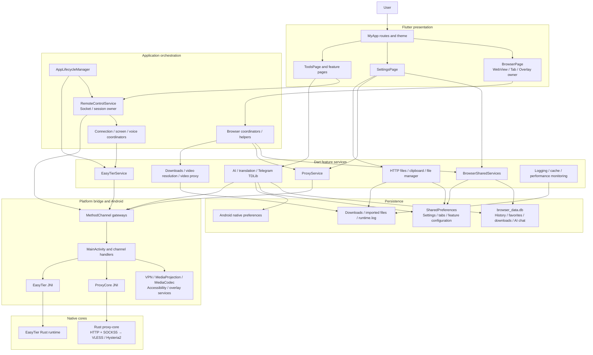

# Lightly Architecture Design

[中文](architecture.md)

## Document Status

This document describes three different things explicitly:

- **Current architecture**: how the repository actually runs today.
- **Target architecture**: the boundaries future refactors should approach.
- **Mandatory principles**: rules new code should follow immediately.

The target structure has not been fully implemented. Directory moves and behavior changes must be
performed separately. See the [Architecture Migration Roadmap](architecture-roadmap.en.md).

## Product and Architecture Positioning

Lightly is not only a WebView browser. It is a lightweight Android capability platform with the
browser acting as its primary workspace:

- The browser owns browsing, tabs, history, favorites, downloads, and media entry points.
- Proxy and EasyTier provide Internet proxying, P2P, and virtual-network capabilities.
- Remote control combines TCP, MediaProjection, MediaCodec, Accessibility, and WebRTC.
- Local HTTP, clipboard, and file services expose device capabilities to the LAN.
- AI, translation, and Telegram are independent tools and must not depend on BrowserPage lifetime.

The implementation is a **Flutter modular monolith with Kotlin platform adapters and Rust network
cores**:

```text
Flutter UI and application orchestration
    ↓
Dart feature services, state, and local networking
    ↓
Typed platform gateways / MethodChannel
    ↓
Android Kotlin system capabilities
    ↓
Rust proxy-core / EasyTier runtime
```

## Design Philosophy

### 1. Local-first

User data, configuration, and local services run on-device by default. Data leaves the device only
for user-initiated browsing, proxy, AI, Telegram, or remote-control activity.

### 2. The browser is a workspace, not the global lifecycle container

`BrowserPage` owns the browsing experience, but independent tools and background services must not
depend on BrowserPage being mounted. Application-level runtime policy belongs in an app runtime
coordinator.

### 3. One owner per resource

- `BrowserPage` owns the active WebView controller and browser-page state.
- `RemoteControlService` owns remote-control sockets, sessions, and protocol state.
- `ProxyService`, `EasyTierService`, and similar services own their native runtime state.

Coordinators may orchestrate owners, but must not duplicate or compete for ownership.

### 4. Platform capabilities go through gateways

Pages, widgets, and ordinary business services must not create new raw `MethodChannel` instances.
Each platform channel needs one typed gateway defining its channel name, methods, arguments, and
results.

### 5. Hot paths use local updates only

WebView progress/scroll, proxy packets, remote video frames, WebRTC stats, and AI SSE deltas must not
trigger page-level rebuilds or high-frequency persisted logs. Prefer `ValueListenable`, local
builders, stream aggregation, throttling, and stale-frame dropping.

### 6. Evolve incrementally without ceremonial layering

Complex features such as browser, remote control, proxy, and EasyTier need clear presentation,
application, domain, and infrastructure boundaries. Small features such as calculator and 2048
should remain shallow and should not gain empty abstractions for appearance alone.

## Current Architecture



## Current Modules and Owners

### App Shell

- `lib/main.dart`: process bootstrap, TDLib initialization, global error capture, and root routes.
- `lib/theme/app_theme.dart`: global visual tokens and Material component theme.
- `AppLifecycleManager`: currently centralizes only part of remote-control and EasyTier shutdown.

### Browser

- `BrowserPage`: owner of WebView, active tab, address bar, page overlays, and Flutter lifecycle.
- `BrowserPageServices`: composes shared services and page-local coordinators.
- `BrowserSharedServices`: singleton collection for browser-related services.
- `BrowserTabService`: source of truth for global tabs and session persistence.
- `BrowserDatabase`: history, visits, favorites, downloads, and AI chat tables.

See [Browser / Remote Module Map](browser_remote_module_map.md) for detailed responsibilities.

### Proxy

The real Android Release path is:

```text
WebView
  → AndroidX WebKit ProxyController
  → 127.0.0.1 mixed HTTP/SOCKS5 port
  → Rust proxy-core inbound
  → VLESS over WebSocket/TLS or Hysteria2/QUIC
  → remote server
```

`ProxyService` owns configuration, reuse, latency tests, download routing, and WebView proxy
override. `ProxyCoreService` controls the Kotlin/JNI/Rust runtime through the
`com.proxy.core/proxy` channel.

### Remote Control

```text
Controller Flutter UI
  → Dart control/screen TCP sockets
  → Receiver RemoteControlService
  → Android MediaProjection / H.264 encoder
  → Dart frame transport
  → Android H.264 decoder / Flutter texture
```

Control commands use a TCP JSON/line protocol. Android AccessibilityService executes touch,
keyboard, global actions, annotations, and disconnect overlays. Dart orchestrates WebRTC voice and
rewrites ICE host candidates for EasyTier routes.

See [Remote Control Architecture](remote-control-architecture.en.md) for the current channels,
owners, connection modes, and lifecycle.

### EasyTier

```text
EasyTier page / remote-control flow
  → EasyTierService
  → easytier_vpn MethodChannel
  → MainActivity / EasyTierJNI
  → EasyTier Rust runtime
  → Android VpnService or no-tun SOCKS5 portal
```

A signature-permission-protected ContentProvider shares runtime state with same-signature monitor
applications.

### Local Services

- `LocalHttpFileServerService`: directory listing, static files, and upload.
- `ClipboardHttpServerService`: LAN clipboard page and save API.
- `SimpleFileManagerService`: file tree, text editing, deletion, and favorite paths.

They keep independent lifecycles but should gradually share address discovery, path sandboxing,
HTTP error handling, and runtime-state primitives.

### AI / Translation / Telegram

- `AiClient`: OpenAI completions/responses and Anthropic messages.
- `AiHistoryDatabase`: reuses the application SQLite database.
- Android `TranslationOverlayService`: executes translation independently while Flutter is paused.
- `TelegramTdlibService`: TDLib authentication, queries, sends, and check-ins using the active local
  SOCKS5 endpoint.

## Current State Model

Lightly does not use a global state-management framework. It primarily uses:

- `StatefulWidget` for short-lived page UI state.
- `ValueNotifier` for small, local, low-cost updates.
- broadcast `StreamController` for service state and remote-control events.
- singleton services for cross-page native/socket/server lifecycles.
- coordinators/helpers for flow and decision logic without resource ownership.

This remains appropriate for the project. Do not migrate everything to Bloc or Riverpod merely for
uniformity. First decide whether state belongs to a page, a feature owner, or the app runtime, then
use the smallest suitable mechanism.

## Current Persistence Boundaries

| Storage | Current content | Target owner |
|---|---|---|
| SQLite `browser_data.db` | History, visits, favorites, downloads, AI chat | `AppDatabase` + feature repositories |
| SharedPreferences | Browser settings, tabs, proxy nodes, AI/TG/EasyTier config, clipboard, tool history | Per-feature `Store` |
| App files | TDLib data, imported files, logs, cache | Corresponding feature service |
| Shared Download | Downloads, backups, log exports | `SharedDownloadsDirectoryService` |
| Android native preferences | Translation overlay history and window state | Native overlay module |

Every value needs one source of truth. Flutter/native shared data must define synchronization
direction, versioning, and failure fallback; two stores must not remain bidirectional writers for the
same state.

## Current Platform Channels

| Channel | Dart owner | Android owner |
|---|---|---|
| `browser_proxy` | `ProxyWebViewBridge` and file/intent gateways | Currently `MainActivity` |
| `com.proxy.core/proxy` | `ProxyCoreService` | `ProxyCoreChannelHandler` |
| `easytier_vpn` | `EasyTierService` | Currently `MainActivity` |
| `remote_control` | `RemoteControlPlatformGateway` | Currently `MainActivity` |
| `floating_video` | Floating-video gateway | `FloatingVideoChannelHandler` / service |
| `translation_overlay` | Translation services | `TranslationOverlayChannelHandler` / service |
| `time_overlay` | `TimeOverlayService` | `TimeOverlayChannelHandler` / service |
| `media_scanner` | `MediaScannerService` | `MediaScannerChannelHandler` |

`browser_proxy`, `easytier_vpn`, and `remote_control` are the next major channels to extract from
`MainActivity`.

## Identified Architecture Debt

1. Service startup is distributed across `main.dart`, `BrowserPageInitializer`, pages, and
   `AppLifecycleManager`, so app-level lifecycle has no single coordinator.
2. `lib/browser/` and `lib/services/` depend on each other; AI and Telegram also depend directly on
   browser implementations.
3. `BrowserDatabase` stores AI data, so its name no longer matches its responsibility.
4. `MainActivity` combines activity, permission, intent, EasyTier, remote-control, and WebView proxy
   responsibilities.
5. Several features create or own MethodChannels directly, distributing the platform contract.
6. SharedPreferences keys, versions, backup sensitivity, and deletion rules have no single catalog.
7. Page owners remain large, but splitting them mechanically by line count would damage ownership.

## Target Dependency Direction

```text
app composition root
    ↓
feature presentation
    ↓
feature application/use cases
    ↓
feature domain contracts
    ↑
feature infrastructure implements contracts

core may be imported by features, but core must not import a feature.
features must not import another feature's infrastructure.
cross-feature work goes through domain ports or an app-level coordinator.
```

Recommended target layout:

```text
lib/
├── app/
│   ├── app.dart
│   ├── routes.dart
│   ├── app_scope.dart
│   └── runtime/
├── core/
│   ├── logging/
│   ├── network/
│   ├── platform/
│   ├── storage/
│   └── ui/
├── features/
│   ├── browser/
│   ├── proxy/
│   ├── video/
│   ├── remote_control/
│   ├── easytier/
│   ├── local_sharing/
│   ├── ai/
│   ├── telegram/
│   └── utilities/
└── theme/
```

Complex features may contain `presentation/`, `application/`, `domain/`, and `infrastructure/`.
Small features should remain one level deep.

## Architecture Rules

- Do not create raw MethodChannels in pages or widgets.
- Do not let a feature directly control another feature's private runtime.
- Do not duplicate WebView, socket, server, or native-service runtime state.
- Do not make a background service depend on a page remaining mounted.
- Do not change behavior in a directory-move commit.
- Do not split owners mechanically based on line count.
- Do not persist hot-path WebView, video, proxy, remote-control, or SSE logs.
- When adding persisted data, document its owner, version, sensitivity, backup policy, and deletion
  policy.

## Verification Strategy

Every architecture migration should ensure:

1. Import-only moves do not change runtime behavior.
2. Resource lifecycle still has one source of truth.
3. Platform-channel contracts have corresponding Dart/Kotlin tests.
4. Database migrations and SharedPreferences remain backward compatible.
5. Browser, proxy, remote-control, and EasyTier regression checklists are followed.

## Related Documents

- [Architecture Migration Roadmap](architecture-roadmap.en.md)
- [Engineering Maintenance Backlog](maintenance-backlog.en.md)
- [Development Guide](development.en.md)
- [UI Design Guidelines](ui-design.en.md)
- [Browser / Remote Module Map](browser_remote_module_map.md)
- [Browser Regression Checklist](browser_regression_checklist.md)
- [Remote Control Regression Checklist](remote_control_regression_checklist.md)
- [Remote Control Architecture](remote-control-architecture.en.md)
- [EasyTier Build Notes](easytier-build.en.md)
- [Sharing EasyTier State with Monitor](easytier-state-sharing.en.md)
