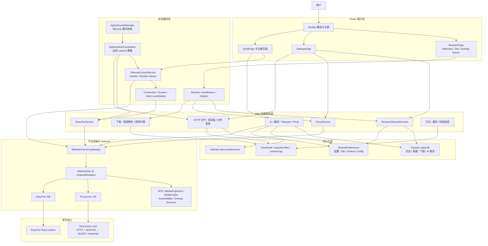

# Lightly 架构设计

[English](architecture.en.md)

## 文档状态

本文档同时描述：

- **当前架构**：仓库今天真实运行的结构与依赖。
- **目标架构**：后续重构应逐步靠拢的边界。
- **强制原则**：新增代码现在就应遵守的约束。

目标架构尚未全部落地。目录移动和行为修改必须分开实施，具体阶段见
[架构迁移路线](architecture-roadmap.md)。

## 产品与架构定位

Lightly 不是单纯的 WebView 浏览器，而是一个以浏览器为工作台、面向 Android
本地能力的轻量工具平台：

- 浏览器负责浏览、标签、历史、收藏、下载与媒体入口。
- 代理与 EasyTier 提供互联网代理、P2P 和虚拟网络能力。
- 远程控制组合 TCP、MediaProjection、MediaCodec、Accessibility 和 WebRTC。
- 本地 HTTP、剪贴板和文件服务把设备能力安全地暴露给局域网。
- AI、翻译和 Telegram 是独立工具功能，不应依附于浏览器页面生命周期。

整体采用 **Flutter 模块化单体 + Kotlin 平台适配 + Rust 网络核心**：

```text
Flutter UI 与应用编排
    ↓
Dart 功能服务、状态与本地网络
    ↓
Typed Platform Gateways / MethodChannel
    ↓
Android Kotlin 系统能力
    ↓
Rust proxy-core / EasyTier runtime
```

## 设计理念

### 1. Local-first

用户数据、配置和本地服务默认在设备上运行。只有用户明确触发的浏览、代理、AI、
Telegram 或远控流量才离开设备。

### 2. 浏览器是工作台，不是全局生命周期容器

`BrowserPage` 是浏览体验 owner，但独立工具和后台服务不能依赖
`BrowserPage` 是否正在展示。服务启动策略应由应用级 runtime coordinator 管理。

### 3. 单一资源 Owner

- `BrowserPage` 持有当前 WebView controller 和浏览器页面状态。
- `RemoteControlService` 持有远控 socket、会话和协议状态。
- `ProxyService`、`EasyTierService` 等服务持有各自 native runtime 状态。

Coordinator 可以编排 owner，但不能复制或竞争资源所有权。

### 4. 平台能力必须经过 Gateway

页面、Widget 和普通业务服务不得新增裸 `MethodChannel`。每个平台通道应由一个
typed gateway 统一定义通道名、方法名、参数与返回值。

### 5. 热路径只允许局部刷新

WebView progress/scroll、代理包、远控视频帧、WebRTC stats 和 AI SSE 增量不得触发
页面级重建或高频持久化日志。优先使用 `ValueListenable`、局部 `ListenableBuilder`、
流聚合、节流和帧丢弃策略。

### 6. 渐进式架构，不追求仪式化分层

浏览器、远控、代理、EasyTier 等复杂功能需要明确的 presentation/application/domain/
infrastructure 边界。计算器、2048 等小功能保持浅层结构，不为了形式创建空抽象。

## 当前整体架构



## 当前模块与 Owner

### App Shell

- `lib/main.dart`：进程 bootstrap、TDLib 初始化、全局错误捕获和依赖注入。
- `lib/app/app.dart`、`lib/app/routes.dart`：根应用和路由表。
- `AppServices`：生产实现的 composition root；跨 feature 能力以 port 暴露。
- `lib/theme/app_theme.dart`：全局视觉令牌和 Material 组件主题。
- `AppRuntimeCoordinator`：应用级 runtime 策略入口；统一 simple file manager、browser runtimes、
  EasyTier/远控和应用退出清理。
- `BrowserRuntimeCoordinator`：proxy、local HTTP、clipboard 的持久化恢复、设置应用、幂等与关闭策略。
- `AppLifecycleManager`：只转发 Flutter lifecycle 事件；兼容方法也仅委托 coordinator。

### Browser

- `BrowserPage`：WebView、active tab、地址栏、页面 overlay 和 Flutter lifecycle owner。
- `BrowserPageServices`：为 BrowserPage 组装共享服务和页面级 coordinator。
- `BrowserSharedServices`：浏览器相关单例服务集合。
- `BrowserTabService`：全局标签与会话持久化 source of truth。
- `AppDatabase`：共享 SQLite schema/句柄 owner；AI 通过 `AppDatabaseProvider` 获取句柄，
  不直接依赖具体数据库类。

浏览器详细职责见 [Browser / Remote 模块分类图](browser_remote_module_map.md)。

### Proxy

当前 Android Release 的真实链路为：

```text
WebView
  → AndroidX WebKit ProxyController
  → 127.0.0.1 mixed HTTP/SOCKS5 port
  → Rust proxy-core inbound
  → VLESS over WebSocket/TLS 或 Hysteria2/QUIC
  → remote server
```

`ProxyService` 负责配置、复用、测速、下载路由和 WebView proxy override；
`ProxyCoreService` 通过 `com.proxy.core/proxy` 通道控制 Kotlin/JNI/Rust runtime。
Dart 实现位于 `lib/features/proxy/`，按 domain/application/infrastructure 分层；浏览器设置通过
不可变 `ProxyConfiguration` snapshot 进入 proxy owner，持久化 key 与 JSON 格式未改变。

### Remote Control

```text
Controller Flutter UI
  → Dart control/screen TCP sockets
  → Receiver RemoteControlService
  → Android MediaProjection / H.264 encoder
  → Dart frame transport
  → Android H.264 decoder / Flutter texture
```

控制命令经 TCP JSON/line protocol 传输，Android AccessibilityService 执行触摸、键盘、
全局动作、标注与断连提示。WebRTC 语音由 Dart 协调，并针对 EasyTier 地址改写 ICE host
candidate。

当前通道、owner、连接模式和 lifecycle 详见
[远程控制架构](remote-control-architecture.md)。

### EasyTier

```text
EasyTierPage / RemoteControl flow
  → EasyTierService
  → easytier_vpn MethodChannel
  → EasyTierChannelHandler / EasyTierJNI
  → EasyTier Rust runtime
  → Android VpnService 或 no-tun SOCKS5 portal
```

同签名 Monitor 应用通过受签名权限保护的 ContentProvider 读取 EasyTier 运行状态。
EasyTier 的 domain/application/infrastructure 与独立 presentation widgets 位于
`lib/features/easytier/`；跨浏览器设置、本地 HTTP 和剪贴板的设置页编排仍暂留 `lib/pages/`。

### Local Services

- `LocalHttpFileServerService`：目录浏览、静态文件、上传。
- `ClipboardHttpServerService`：局域网剪贴板页面与保存接口。
- `SimpleFileManagerService`：文件树、文本编辑、删除和收藏路径。

三者保持独立生命周期，但应逐步复用地址解析、路径沙箱、响应错误处理和运行状态模型。

### AI / Translation / Telegram

- `AiClient`：OpenAI completions/responses 与 Anthropic messages。
- `AiHistoryDatabase`：复用应用 SQLite 数据库。
- Android `TranslationOverlayService`：Flutter 后台时独立执行翻译。
- `TelegramTdlibService`：TDLib 登录、查询、发送和签到，并使用当前本地 SOCKS5 端点。

## 当前状态管理模型

Lightly 没有引入全局状态管理框架，主要使用：

- `StatefulWidget`：页面级短生命周期 UI 状态。
- `ValueNotifier`：局部、低成本 UI 更新。
- broadcast `StreamController`：服务运行状态与远控消息。
- singleton service：跨页面 native/socket/server 生命周期。
- coordinator/helper：无资源所有权的流程和决策逻辑。

这个模型仍适合当前项目，不应为了统一风格整体迁移到 Bloc/Riverpod。新状态首先应判断
它属于页面、feature owner 还是应用 runtime，再选择最小机制。

## 当前持久化边界

| 存储 | 当前内容 | 目标 Owner |
|---|---|---|
| SQLite `browser_data.db` | 历史、访问记录、收藏、下载、AI 聊天 | `AppDatabase` + feature repositories |
| SharedPreferences | 浏览器设置、Tab、代理节点、AI/TG/EasyTier 配置、剪贴板、工具历史 | 各 feature `Store` |
| App files | TDLib 数据、导入文件、日志、缓存 | 对应 feature service |
| Shared Download | 下载、备份、日志导出 | `SharedDownloadsAccess`；当前实现 `SharedDownloadsDirectoryService` |
| Android native preferences | 悬浮翻译历史和窗口状态 | native overlay module |

每份数据必须只有一个 source of truth。跨 Flutter/native 的数据需要明确同步方向、版本和
失败回退，不能让两个存储长期双向写入同一状态。
完整 key/table/file 清单见 [数据所有权清单](data-ownership.md)。

## 当前平台通道

| Channel | Dart Owner | Android Owner |
|---|---|---|
| `browser_proxy` | `ProxyPlatformGateway`、`StorageAccessGateway`、`ExternalIntentGateway` | `BrowserPlatformChannelHandler` 及分组 handler |
| `com.proxy.core/proxy` | `ProxyCoreService` | `ProxyCoreChannelHandler` |
| `easytier_vpn` | `EasyTierPlatformGateway` / `EasyTierService` | `EasyTierChannelHandler` |
| `remote_control` | `RemoteControlPlatformGateway` | `RemoteControlChannelHandler` |
| `floating_video` | floating video gateway | `FloatingVideoChannelHandler` / service |
| `translation_overlay` | translation services | `TranslationOverlayChannelHandler` / service |
| `time_overlay` | `TimeOverlayService` | `TimeOverlayChannelHandler` / service |
| `media_scanner` | `MediaScannerService` | `MediaScannerChannelHandler` |

`browser_proxy`、`easytier_vpn` 和 `remote_control` 已从 `MainActivity` 提取；Activity 仅注册
独立 handler 并转交权限/投屏结果与销毁事件。

## 已识别的架构债务

1. Runtime 策略代码已收口到 app/browser coordinators；Phase 2 仍需真机验证完整退出后无
   VPN/capture 前台服务残留。
2. AI、Telegram、proxy、EasyTier 与 remote-control 非 owner 模块已归入 feature；
   `RemoteControlService` 按资源所有权暂留 `lib/services/`。仍在 `lib/pages/`、`lib/browser/`
   的 remote-control presentation 与 browser/video 编排需继续按 domain port 或 app-level
   coordinator 收敛。
3. SharedPreferences 旧 key 已冻结为兼容合同；后续破坏性格式变化仍需逐 feature 提供
   版本化 key 和显式迁移。
4. 页面级 owner 仍很大，但盲目按行数拆分会破坏资源所有权。

## 目标依赖方向

```text
app composition root
    ↓
feature presentation
    ↓
feature application/use cases
    ↓
feature domain contracts
    ↑
feature infrastructure implements contracts

core 只能被 feature 依赖，不能依赖任何 feature。
feature 不得直接依赖另一个 feature 的 infrastructure。
跨 feature 协作通过 domain port 或 app-level coordinator 完成。
```

推荐目标目录：

```text
lib/
├── app/
│   ├── app.dart
│   ├── routes.dart
│   ├── app_scope.dart
│   └── runtime/
├── core/
│   ├── logging/
│   ├── network/
│   ├── platform/
│   ├── storage/
│   └── ui/
├── features/
│   ├── browser/
│   ├── proxy/
│   ├── video/
│   ├── remote_control/
│   ├── easytier/
│   ├── local_sharing/
│   ├── ai/
│   ├── telegram/
│   └── utilities/
└── theme/
```

复杂 feature 可以继续分 `presentation/`、`application/`、`domain/`、`infrastructure/`；
小 feature 保持一层目录即可。

## 架构守则

- 不在页面或 Widget 中新增裸 MethodChannel。
- 不让 feature 直接控制另一个 feature 的 private runtime。
- 不复制 WebView、socket、server、native service 的运行状态。
- 不让后台服务依赖某个页面保持 mounted。
- 不在移动目录的提交中修改行为。
- 不按文件行数机械拆分 owner。
- 不在 WebView、视频、代理、远控和 SSE 热路径持久化高频日志。
- 新增持久化数据时同时记录 owner、版本、敏感级别、备份与清除策略。

## 验证策略

每次架构迁移应至少保证：

1. import-only 移动不改变运行行为。
2. owner 的资源生命周期仍有单一 source of truth。
3. platform channel contract 有 Dart/Kotlin 对应测试。
4. 数据库迁移和 SharedPreferences 兼容旧版本。
5. 浏览器、代理、远控和 EasyTier 按各自回归清单验证。

## 相关文档

- [架构迁移路线](architecture-roadmap.md)
- [工程维护待办](maintenance-backlog.md)
- [开发指南](development.md)
- [界面设计规范](ui-design.md)
- [Browser / Remote 模块分类图](browser_remote_module_map.md)
- [浏览器回归清单](browser_regression_checklist.md)
- [远程控制回归清单](remote_control_regression_checklist.md)
- [远程控制架构](remote-control-architecture.md)
- [EasyTier 编译记录](easytier-build.md)
- [EasyTier 状态共享给 Monitor](easytier-state-sharing.md)
