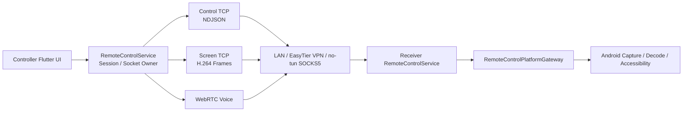
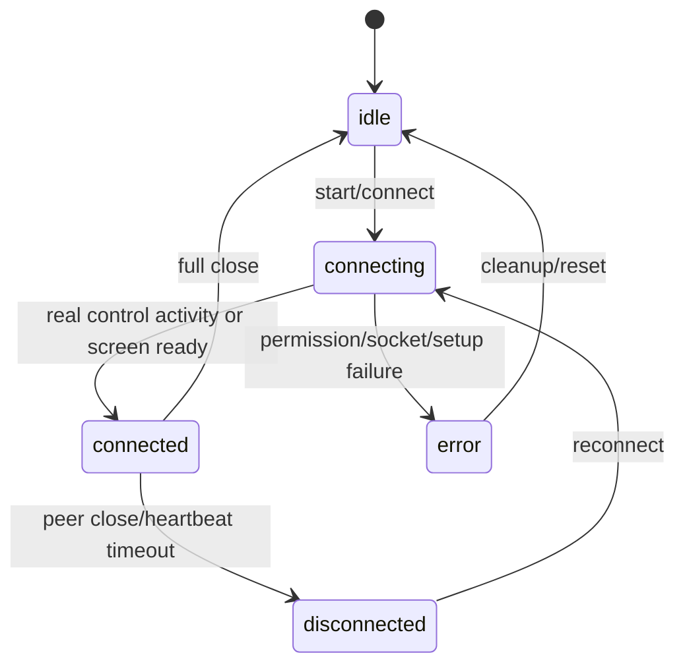

# Lightly Remote Control Architecture

[中文](remote-control-architecture.md)

## Document Status

This document describes the implemented remote-control runtime. The early temporary proposal using
a fixed UDP/Opus audio port is obsolete. Voice now uses WebRTC, while control and screen transport
remain separate TCP channels.

## Goals

- Reuse one session model across LAN, EasyTier VPN, and EasyTier no-tun modes.
- Keep control commands reliable while favoring fresh screen frames over stale backlog.
- Keep Android system capabilities in Kotlin and session orchestration in Dart.
- Maintain one owner for sockets and session state.

## Runtime Flow



## Ownership

| Component | Owns | Must not own |
|---|---|---|
| `RemoteControlService` | Control/screen sockets, session state, heartbeat, reconnect, routing | Widget layout or BuildContext |
| `RemoteControlConnectionFlowCoordinator` | Connection and port-probe decisions | Long-lived sockets |
| `RemoteControlMessageRouter` | Protocol dispatch | MethodChannels |
| `RemoteControlScreenFrameSender` | Key/delta queue and freshness policy | Control commands |
| `ScreenCaptureManager` | Native capture lifecycle and frame stream | Socket/session state |
| `RemoteControlVoiceCoordinator` | WebRTC signaling and network preference | TCP socket state |
| `RemoteControlPlatformGateway` | Typed Dart/Kotlin contract | Page state |
| Kotlin capture/decode/accessibility | MediaProjection, MediaCodec, input/system actions | Dart session policy |

Dart config/protocol contracts, connection/screen/voice application policies, socket/status,
screen-capture, WebRTC infrastructure, and the typed gateway now live under
`lib/features/remote_control/`. `ScreenFrame` only wraps the original `Uint8List`; the screen
sender, pipeline, watchdog, and socket adapters do not retain sockets. `WebRtcVoiceService` owns its
PeerConnection, tracks, and timers, but `RemoteControlService` still creates and closes it.
`RemoteControlService` remains in `lib/services/` as the single owner of control/screen sockets and
session state. Independent screen/session/setup/dialog widgets now live under feature
presentation. The two pages consume EasyTier/proxy/browser-settings capabilities through app-level
`RemoteControlPageCoordinator` instead of importing another feature's infrastructure. They remain
in `lib/pages/` until the presentation-facing contract and service-owner injection boundary
stabilize.

## Transport and Ports

### Control TCP

- Newline-delimited JSON carries gesture, keyboard, heartbeat, ack, error, and status messages.
- Status messages include `port_config`, `screen_info`, WebRTC signaling, and microphone state.
- Control commands are reliable and must not be dropped as a latency optimization.

### Screen TCP

- Carries H.264 frames produced by Android MediaCodec.
- Kotlin `H264Decoder` renders into a Flutter texture on the controller.
- When busy, preserve key frames and only the newest pending delta frame.
- Black-screen recovery rebuilds only the controller screen socket and requests fresh config/key
  frames; it does not stop the receiver.

### WebRTC Voice

- There is no fixed third audio port.
- Offer, answer, and candidates travel over control TCP; WebRTC negotiates media transport.
- EasyTier `10.126.*` sessions prefer the proven remote-control address and rewrite host candidates
  when needed.
- Built-in-proxy and no-tun modes do not provide WebRTC voice.

### Port Range

`RemoteControlPortConfig` selects a base port from `18080-18087`:

```text
control = base
screen  = base + 1
```

A short connection that only reads `port_config` is a probe. It must not mark the receiver
connected or trigger a disconnect notification.

## Connection Modes

| Mode | Control/Screen | Voice | Constraint |
|---|---|---|---|
| LAN | Direct TCP | WebRTC | Use the concrete LAN address |
| EasyTier VPN | Direct TCP to `10.126.*` | WebRTC | Wait for virtual IPv4 and routes |
| EasyTier no-tun | Local SOCKS5 portal | Disabled | Do not start Android VpnService or restart an existing instance |
| Built-in proxy | Internal proxy path | Disabled | Keep control/screen available and expose the limitation in UI |

## Session Lifecycle



- Receiver startup succeeds only after permission, native capture, and socket listening succeed.
- Re-entering `RemoteControlPage` restores running ports and no-VPN state from the singleton owner.
- Heartbeats run every two seconds; ten missed checks enter offline handling.
- Temporary close disconnects only the controller. Full close releases sockets, capture, decoder,
  audio, accessibility state, and EasyTier resources started by this flow.
- App shutdown coordinates cleanup, while each owner still releases its own resources.

## Android Boundary

- `ScreenCapture.kt`: MediaProjection, VirtualDisplay, AVC encoder, compatibility fallback.
- `H264Decoder.kt`: decoder configuration/reconfiguration from SPS/PPS dimensions.
- `RemoteControlAccessibilityService.kt`: gestures, keyboard, global actions, annotations, notices.
- `RemoteControlScreenCaptureService.kt`: foreground capture lifecycle.
- Dart accesses `remote_control` only through `RemoteControlPlatformGateway`.
- Video frames remain direct `Uint8List`; do not add JSON/Base64/event-bus copies.

## Performance Rules

- Do not persist per-frame, per-gesture, or periodic ICE-stat logs.
- Screen transport may drop stale delta frames; control transport may not drop commands.
- Apply primary backpressure before socket writes; viewer coalescing is only a second guard.
- Video frames must not trigger page-wide `setState()`.
- Prefer the existing codec/capture fallback over blindly increasing bitrate.

## Evolution Boundaries

- Session projections, receiver/controller use cases, and diagnostics facades may be extracted.
- Do not spread socket fields across multiple long-lived services.
- Coordinators must not hold BuildContext or duplicate mutable session state.
- Audio transport is high-risk and should move only with complete WebRTC regression coverage.

## Verification

See the [Remote Control Regression Checklist](remote_control_regression_checklist.md) and the
specialized WebRTC, Redmi capture/decoder, and EasyTier rules in root `AGENTS.md`.
