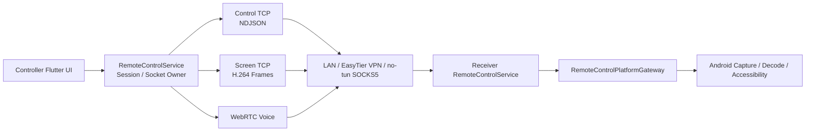
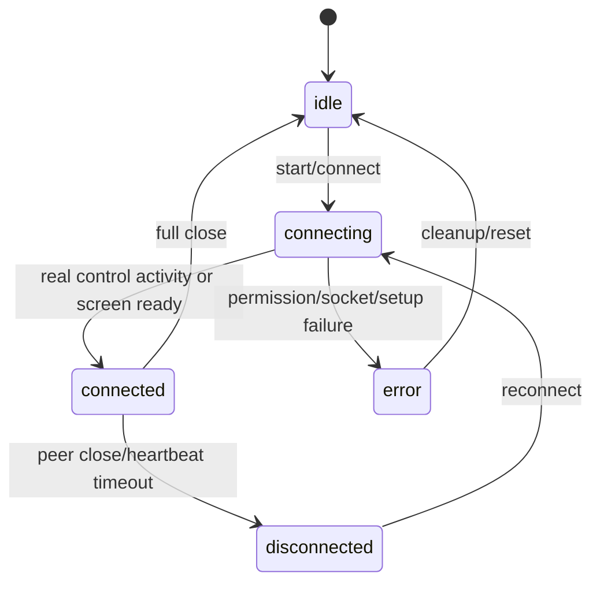

# Lightly 远程控制架构

[English](remote-control-architecture.en.md)

## 文档状态

本文描述当前已经落地的远程控制结构。早期临时方案中的“固定 UDP 音频端口 + Opus”已不再
是现状；当前语音使用 WebRTC，控制与屏幕仍使用独立 TCP 通道。

## 设计目标

- 在 LAN、EasyTier VPN 和 EasyTier no-tun 模式下复用同一远控业务模型。
- 保证控制命令可靠，同时让屏幕流优先显示最新画面而不是积压旧帧。
- 将 Android 系统能力留在 Kotlin，将会话编排和跨平台状态留在 Dart。
- 一个 owner 持有 socket 与会话状态，页面和 coordinator 不复制资源所有权。

## 整体链路



## Owner 与职责

| 组件 | 职责 | 不应承担 |
|---|---|---|
| `RemoteControlService` | control/screen socket、会话状态、心跳、重连、消息路由 | Widget 布局、直接持有 BuildContext |
| `RemoteControlConnectionFlowCoordinator` | 连接流程与端口探测决策 | 长期持有 socket |
| `RemoteControlMessageRouter` | 协议消息分发 | 创建 MethodChannel |
| `RemoteControlScreenFrameSender` | key/delta 帧排队与新鲜度策略 | 控制通道命令 |
| `ScreenCaptureManager` | native capture 生命周期与帧 stream | socket/session state |
| `RemoteControlVoiceCoordinator` | WebRTC 信令与网络偏好 | TCP socket owner |
| `RemoteControlPlatformGateway` | typed Dart/Kotlin 通道契约 | 页面状态 |
| Kotlin capture/decode/accessibility | MediaProjection、MediaCodec、手势/键盘/全局动作 | Dart 会话策略 |

Dart domain contracts、connection/screen/voice application policies、`ScreenCaptureManager`、
WebRTC infrastructure 与 typed gateway 已位于 `lib/features/remote_control/`。其中
`ScreenFrame` 只包装原始 `Uint8List`，screen sender/pipeline/watchdog 不持有长期 socket；
`WebRtcVoiceService` 持有 PeerConnection/tracks/timers，但仍由 `RemoteControlService` 创建和
关闭。`RemoteControlService` 继续作为 control/screen socket 与 session state 的唯一 owner，
直到其跨 feature 依赖经端口收敛。

## 传输与端口

### Control TCP

- 使用换行分隔 JSON（NDJSON）。
- 承载 gesture、keyboard、heartbeat、ack、error、status。
- `status` 包含 `port_config`、`screen_info`、WebRTC offer/answer/candidate、麦克风状态等。
- 控制命令优先可靠传输，不允许为了降延迟而静默丢弃。

### Screen TCP

- 传输 Android MediaCodec 产生的 H.264 帧。
- Controller 通过 Kotlin `H264Decoder` 解码并输出到 Flutter texture。
- 发送端繁忙时保留 key frame，并只保留最新 pending delta frame，避免网络队列回放旧画面。
- 黑屏恢复只重建 controller screen socket 并请求 config/key frame，不关闭 receiver。

### WebRTC Voice

- 不使用固定第三音频端口。
- offer/answer/candidate 经 control TCP 交换，媒体由 WebRTC 协商。
- EasyTier `10.126.*` 会话优先使用已验证的远控目标地址，并在必要时改写 host candidate。
- 内置代理和 no-tun 模式不提供 WebRTC 语音。

### 端口范围

`RemoteControlPortConfig` 在 `18080-18087` 中选择 base port：

```text
control = base
screen  = base + 1
```

Controller 会探测常用端口组。仅用于读取 `port_config` 的短连接是 probe，不能让 Receiver
进入 connected 或弹出“对方已断开”。

## 连接模式

| 模式 | Control/Screen | Voice | 关键约束 |
|---|---|---|---|
| LAN | 直接 TCP | WebRTC | 使用实际 LAN IP |
| EasyTier VPN | `10.126.*` 直接 TCP | WebRTC | 等待 virtual IPv4 与路由 ready |
| EasyTier no-tun | 本地 SOCKS5 portal 转发 | 禁用 | 不启动 Android VpnService，不重启已有 no-tun instance |
| 内置代理 | 本地代理路径 | 禁用 | 保持控制/屏幕可用，UI 明确语音不可用 |

## 会话状态与生命周期



- Receiver 启动成功以屏幕权限、native capture 和 socket 监听全部完成为准。
- `RemoteControlPage` 重建或重新进入时，从 singleton service 恢复 running/ports/no-VPN 状态。
- 心跳间隔为 2 秒；连续 10 次未响应后进入离线处理。
- 临时关闭只断开 Controller；完整关闭会清理 socket、capture、decoder、audio、accessibility
  和由本流程启动的 EasyTier。
- App 退出由应用级 lifecycle 清理统一收口，具体资源仍由各 owner 释放。

## Android 平台边界

- `ScreenCapture.kt`：MediaProjection、VirtualDisplay、AVC encoder 与设备兼容降级。
- `H264Decoder.kt`：从 SPS/PPS 获取真实尺寸后配置/重配 decoder。
- `RemoteControlAccessibilityService.kt`：点击、滑动、轨迹、键盘、全局动作、标注和系统提示。
- `RemoteControlScreenCaptureService.kt`：capture 前台服务生命周期。
- Dart 只能通过 `RemoteControlPlatformGateway` 访问 `remote_control` 通道。
- 视频帧保持 `Uint8List` 直传，不增加 JSON/Base64 或 event-bus 拷贝。

## 性能原则

- 不持久化逐帧、逐手势、ICE stats 轮询日志。
- 屏幕链路允许丢弃旧 delta frame，但不丢控制命令。
- Viewer 合帧只是第二道保护，主要背压应在 sender/socket 写入前处理。
- UI 状态更新应局部化；视频帧不得触发整页 `setState()`。
- 高分辨率或无首帧时优先走现有 codec/capture fallback，不盲目提高码率。

## 演进边界

- 可以继续提取 session projection、receiver/controller use case 和 diagnostics facade。
- 不把 socket 字段拆到多个长期 service。
- 不让 coordinator 持有 BuildContext 或复制 mutable session state。
- audio transport 是高风险边界，只有在 WebRTC 回归测试完备时才进一步拆分。

## 验证

自动测试与真机步骤见 [远程控制回归清单](remote_control_regression_checklist.md)。涉及 WebRTC、
红米 capture/decoder 或 EasyTier 路径时，还必须遵循根目录 `AGENTS.md` 的专项验证规则。
